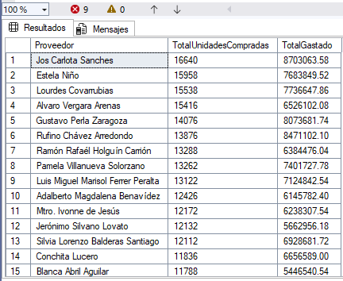

# Proceso ETL de la empresa SG-FOOD: extracción, transformación y carga

## Descripción del Proyecto

Este proyecto implementa un proceso completo de **ETL (Extract, Transform, Load)** para la empresa SG-FOOD, utilizando **SQL Server Integration Services (SSIS)** como herramienta principal. El objetivo es crear un Data Warehouse dimensional que permita el análisis eficiente de las operaciones de compras y ventas de la empresa.

## Arquitectura del Proceso ETL

### Flujo de Datos
El proceso ETL implementado sigue el siguiente flujo:

```
Archivos Planos (CSV/TXT) → SSIS Data Flow → Transformaciones → Base de Datos Dimensional
```

### Componentes SSIS Utilizados

1. **Flat File Data Source**: Para la extracción de datos desde archivos planos
2. **Data Conversion**: Para transformar tipos de datos según sea necesario
3. **Derived Column**: Para crear columnas calculadas y transformaciones de datos
4. **Sort**: Para ordenamiento de datos antes de las cargas
5. **Multicast**: Para distribuir los datos a múltiples destinos
6. **Lookup**: Para búsquedas y validaciones de datos de referencia
7. **OLE DB Destination**: Para la carga final hacia las tablas dimensionales y de hechos

## Descripción de Cada Paso del Proceso ETL

### 1. Extracción (Extract)
- **Fuentes de Datos**: Archivos planos (CSV/TXT) con información de:
  - Datos de clientes
  - Información de productos
  - Registros de proveedores
  - Datos de sucursales
  - Información de vendedores
  - Transacciones de compras
  - Transacciones de ventas

### 2. Transformación (Transform)
- **Conversión de Tipos de Datos**: Transformación de formatos de archivos planos a tipos compatibles con SQL Server
- **Limpieza de Datos**: Eliminación de espacios en blanco, normalización de texto
- **Validación**: Verificación de integridad referencial mediante componentes Lookup
- **Enriquecimiento**: Creación de claves foráneas y campos calculados
- **Ordenamiento**: Organización de datos para optimizar la carga

### 3. Carga (Load)
- **Carga Dimensional**: Población de tablas de dimensiones (DimCliente, DimProducto, etc.)
- **Carga de Hechos**: Inserción de datos transaccionales en HechoCompras y HechoVentas
- **Mantenimiento**: Truncado y recarga de tablas según sea necesario

## Modelo Empresarial Implementado

### Justificación de la Elección del Modelo
Se implementó un **modelo dimensional tipo estrella (Star Schema)** por las siguientes razones:

1. **Simplicidad**: Estructura fácil de entender y mantener
2. **Performance**: Consultas optimizadas con menos JOINs
3. **Escalabilidad**: Facilita la adición de nuevas dimensiones
4. **Compatibilidad**: Ideal para herramientas de Business Intelligence
5. **Desnormalización**: Mejora el rendimiento de consultas analíticas

### Características del Modelo

- **Tablas de Dimensiones**: Contienen los datos descriptivos del negocio
- **Tablas de Hechos**: Almacenan las métricas y transacciones del negocio
- **Claves Subrogadas**: Utilizadas para optimizar el rendimiento
- **Granularidad**: Nivel de detalle por transacción individual

## Detalle de Tablas del Modelo Empresarial

### Tablas de Dimensiones

#### DimCliente
```sql
CREATE TABLE DimCliente (
    IdCliente NVARCHAR(100) PRIMARY KEY,
    Nombre NVARCHAR(100) NOT NULL
);
```
- **Propósito**: Almacenar información de los clientes
- **Campos**: Identificador único y nombre del cliente

#### DimFecha
```sql
CREATE TABLE DimFecha (
    IdFecha INT PRIMARY KEY,
    Anio INT NOT NULL,
    Mes INT NOT NULL,
    MesNombre NVARCHAR(150),
    DiaSemana NVARCHAR(150)
);
```
- **Propósito**: Dimensión temporal para análisis por períodos
- **Campos**: Jerarquía temporal (año, mes, día de la semana)

#### DimProducto
```sql
CREATE TABLE DimProducto (
    IdProducto NVARCHAR(150) PRIMARY KEY,
    Nombre NVARCHAR(150) NOT NULL,
    Marca NVARCHAR(150) NOT NULL
);
```
- **Propósito**: Catálogo de productos de la empresa
- **Campos**: Identificador, nombre y marca del producto

#### DimProveedor
```sql
CREATE TABLE DimProveedor (
    IdProveedor NVARCHAR(150) PRIMARY KEY,
    Nombre NVARCHAR(150) NOT NULL
);
```
- **Propósito**: Directorio de proveedores
- **Campos**: Identificador único y nombre del proveedor

#### DimSucursal
```sql
CREATE TABLE DimSucursal (
    IdSucursal NVARCHAR(150) PRIMARY KEY,
    Nombre NVARCHAR(150) NOT NULL,
    Departamento NVARCHAR(150) NOT NULL,
    Region NVARCHAR(150) NOT NULL
);
```
- **Propósito**: Ubicaciones geográficas de las sucursales
- **Campos**: Jerarquía geográfica (sucursal, departamento, región)

#### DimVendedor
```sql
CREATE TABLE DimVendedor (
    IdVendedor NVARCHAR(150) PRIMARY KEY,
    Nombre NVARCHAR(150) NOT NULL
);
```
- **Propósito**: Personal de ventas de la empresa
- **Campos**: Identificador único y nombre del vendedor

### Tablas de Hechos

#### HechoCompras
```sql
CREATE TABLE HechoCompras (
    IdCompra INT IDENTITY(1,1) PRIMARY KEY,
    IdFecha INT NOT NULL,
    IdProveedor NVARCHAR(150),
    IdProducto NVARCHAR(150),
    IdSucursal NVARCHAR(150),
    Cantidad INT NOT NULL,
    Costo DECIMAL(18,2) NOT NULL
);
```
- **Propósito**: Transacciones de compras a proveedores
- **Métricas**: Cantidad y costo de los productos comprados
- **Granularidad**: Una fila por línea de compra

#### HechoVentas
```sql
CREATE TABLE HechoVentas (
    IdVenta INT IDENTITY(1,1) PRIMARY KEY,
    IdFecha INT NOT NULL,
    IdCliente NVARCHAR(100),
    IdProducto NVARCHAR(150),
    IdSucursal NVARCHAR(150),
    IdVendedor NVARCHAR(150),
    Cantidad INT NOT NULL,
    Precio DECIMAL(18,2) NOT NULL
);
```
- **Propósito**: Transacciones de ventas a clientes
- **Métricas**: Cantidad y precio de los productos vendidos
- **Granularidad**: Una fila por línea de venta

## Resultados de Consultas y Pruebas del Modelo

### 1. Análisis de Compras por Año
```sql
SELECT 
    df.Anio,
    SUM(hc.Costo * hc.Cantidad) AS TotalCompras
FROM HechoCompras hc
JOIN DimFecha df ON hc.IdFecha = df.IdFecha
GROUP BY df.Anio
ORDER BY df.Anio;
```


**Propósito**: Analizar la evolución de los gastos en compras por año.

### 2. Análisis de Ventas por Año
```sql
SELECT 
    df.Anio,
    SUM(hv.Precio * hv.Cantidad) AS TotalVentas
FROM HechoVentas hv
JOIN DimFecha df ON hv.IdFecha = df.IdFecha
GROUP BY df.Anio
ORDER BY df.Anio;
```


**Propósito**: Evaluar el crecimiento de ingresos por ventas anuales.

### 3. Productos con Pérdidas
```sql
SELECT 
    p.Nombre AS Producto,
    AVG(hv.Precio) AS PrecioPromedioVenta,
    AVG(hc.Costo) AS CostoPromedioCompra
FROM HechoVentas hv
JOIN DimProducto p ON hv.IdProducto = p.IdProducto
JOIN HechoCompras hc ON hc.IdProducto = p.IdProducto
GROUP BY p.Nombre
HAVING AVG(hv.Precio) < AVG(hc.Costo);
```
**Propósito**: Identificar productos que se venden por debajo de su costo promedio.


### 4. Top 5 Productos Más Vendidos
```sql
SELECT TOP 5
    p.Nombre AS Producto,
    SUM(hv.Cantidad) AS TotalUnidadesVendidas
FROM HechoVentas hv
JOIN DimProducto p ON hv.IdProducto = p.IdProducto
GROUP BY p.Nombre
ORDER BY SUM(hv.Cantidad) DESC;
```
**Propósito**: Determinar los productos con mayor volumen de ventas.


### 5. Ingresos por Región y Año
```sql
SELECT 
    s.Region,
    df.Anio,
    SUM(hv.Precio * hv.Cantidad) AS IngresosTotales
FROM HechoVentas hv
JOIN DimSucursal s ON hv.IdSucursal = s.IdSucursal
JOIN DimFecha df ON hv.IdFecha = df.IdFecha
GROUP BY s.Region, df.Anio
ORDER BY s.Region, df.Anio;
```


**Propósito**: Analizar el rendimiento financiero por ubicación geográfica.

### 6. Proveedores con Mayor Volumen
```sql
SELECT 
    pr.Nombre AS Proveedor,
    SUM(hc.Cantidad) AS TotalUnidadesCompradas,
    SUM(hc.Costo * hc.Cantidad) AS TotalGastado
FROM HechoCompras hc
JOIN DimProveedor pr ON hc.IdProveedor = pr.IdProveedor
GROUP BY pr.Nombre
ORDER BY TotalUnidadesCompradas DESC;
```



**Propósito**: Identificar los proveedores más importantes por volumen y gasto.

## Beneficios del Modelo Implementado

1. **Análisis Multidimensional**: Permite analizar las métricas desde múltiples perspectivas
2. **Consultas Eficientes**: Estructura optimizada para reportes y análisis
3. **Escalabilidad**: Facilita la incorporación de nuevas dimensiones y métricas
4. **Histórico**: Mantiene el registro histórico de todas las transacciones
5. **Flexibilidad**: Adaptable a diferentes necesidades de análisis del negocio

## Tecnologías Utilizadas

- **SQL Server**: Base de datos relacional
- **SSIS (SQL Server Integration Services)**: Herramienta ETL
- **T-SQL**: Lenguaje de consultas y definición de datos

## Conclusión

El modelo dimensional implementado para SG-FOOD es tipo constelación ya que hay dos tablas hecho, este modelo proporciona una base sólida para el análisis empresarial, permitiendo a la organización tomar decisiones informadas basadas en datos históricos y tendencias del negocio. La arquitectura ETL con SSIS garantiza un proceso eficiente y confiable de carga de datos.