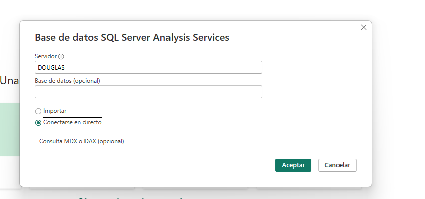

# Practica 2

    * Douglas Darío Rivera Ojeda
    * 201122881


# Explicación del Esquema OLAP - Modelo Dimensional de Ventas

## Descripción General
Este diagrama representa un **modelo dimensional** típico de un sistema OLAP (Online Analytical Processing) diseñado para el análisis de ventas. El esquema sigue el patrón de **esquema de estrella** donde una tabla de hechos central se conecta con múltiples tablas de dimensiones.

## Componentes del Modelo

###  Tabla de Hechos Central
**HechoVentas**
- **Función**: Almacena las métricas cuantitativas del negocio
- **Campos principales**:
  - `IdVenta` - Identificador único de la venta
  - `IdFecha` - Clave foránea hacia la dimensión tiempo
  - `IdCliente` - Clave foránea hacia la dimensión cliente  
  - `IdSucursal` - Clave foránea hacia la dimensión sucursal
  - `IdVendedor` - Clave foránea hacia la dimensión vendedor
  - `Cantidad` - Métrica de cantidad vendida
  - `Precio` - Métrica del precio de venta

###  Dimensión Tiempo
**DimFecha**
- **Propósito**: Permite análisis temporal de las ventas
- **Atributos**:
  - `IdFecha` - Clave primaria
  - `Año` - Agrupación por año
  - `Mes` - Agrupación por mes
  - `MesNombre` - Nombre del mes (Enero, Febrero, etc.)
  - `DiaSemana` - Día de la semana para análisis de patrones

###  Dimensión Sucursal
**DimSucursal**
- **Propósito**: Análisis geográfico y organizacional de ventas
- **Atributos**:
  - `IdSucursal` - Clave primaria
  - `Nombre` - Nombre de la sucursal
  - `Departamento` - Departamento/Estado donde se ubica
  - `Region` - Región geográfica para agrupaciones superiores

###  Dimensión Producto
**DimProducto**
- **Propósito**: Análisis de ventas por productos y categorías
- **Atributos**:
  - `IdProducto` - Clave primaria
  - `Nombre` - Nombre del producto
  - `Marca` - Marca del producto para análisis de marcas

###  Dimensión Cliente
**DimCliente**
- **Propósito**: Segmentación y análisis de clientes
- **Atributos**:
  - `IdCliente` - Clave primaria
  - `Nombre` - Nombre del cliente

###  Dimensión Vendedor
**DimVendedor**
- **Propósito**: Análisis de desempeño de vendedores
- **Atributos**:
  - `IdVendedor` - Clave primaria
  - `Nombre` - Nombre del vendedor

###  Dimensión Proveedor
**DimProveedor**
- **Propósito**: Análisis de la cadena de suministro
- **Atributos**:
  - `IdProveedor` - Clave primaria
  - `Nombre` - Nombre del proveedor

## Características del Modelo


###  Tipos de Análisis Posibles
- **Temporal**: Ventas por año, mes, día de la semana
- **Geográfico**: Ventas por región, departamento, sucursal
- **Productos**: Análisis por marca, producto individual
- **Vendedores**: Desempeño individual y comparativo
- **Clientes**: Segmentación y análisis de comportamiento

###  Consultas Típicas OLAP
```sql
-- Ejemplo: Ventas totales por región y mes
SELECT 
    ds.Region,
    df.MesNombre,
    SUM(hv.Cantidad) as TotalCantidad,
    SUM(hv.Precio) as TotalVentas
FROM HechoVentas hv
JOIN DimSucursal ds ON hv.IdSucursal = ds.IdSucursal
JOIN DimFecha df ON hv.IdFecha = df.IdFecha
GROUP BY ds.Region, df.MesNombre, df.Mes
ORDER BY ds.Region, df.Mes;
```

##  Casos de Uso del Negocio
1. **Análisis de Tendencias**: Identificar patrones estacionales de ventas
2. **Evaluación Regional**: Comparar desempeño entre diferentes regiones
3. **Gestión de Inventario**: Análizar productos más vendidos por ubicación
4. **Evaluación de Personal**: Medir desempeño de vendedores
5. **Estrategia de Clientes**: Identificar clientes más valiosos
6. **Análisis de Proveedores**: Evaluar el desempeño de productos por proveedor

##  Optimizaciones Recomendadas
- **Índices**: Crear índices en las claves foráneas de la tabla de hechos
- **Particionamiento**: Particionar la tabla de hechos por fecha
- **Agregaciones**: Crear tablas de agregados para consultas frecuentes
- **Compresión**: Utilizar técnicas de compresión para optimizar almacenamiento

# Explicación del Cubo OLAP - Sistema de Análisis Multidimensional


## Descripción General del Cubo
Este es un **cubo OLAP** (Online Analytical Processing) implementado en una herramienta de Business Intelligence que permite análisis multidimensional de datos de ventas. El cubo está construido sobre un modelo dimensional de estrella y proporciona capacidades avanzadas de análisis empresarial.

##  Estructura del Cubo OLAP

###  Cubo Principal: vistaCubo
El cubo central que integra todas las dimensiones y medidas para análisis multidimensional de ventas.

##  Medidas Disponibles

### Medidas Principales
- ** Hecho_Ventas**: Medida principal que representa las transacciones de venta
- ** Hecho_Compras**: Medida para análisis de compras y cadena de suministro  
- ** Hecho_Ventas_1**: Medida adicional de ventas (posiblemente con diferente granularidad o cálculo)

### Características de las Medidas
- **Agregabilidad**: Las medidas se pueden sumar, promediar o calcular según diferentes dimensiones
- **Cálculos Automáticos**: El cubo calcula automáticamente totales, subtotales y agregaciones
- **Performance Optimizada**: Las medidas están pre-calculadas para consultas rápidas

##  Dimensiones del Cubo

###  Dim_Fecha
**Análisis Temporal Avanzado**
- Permite drill-down desde año → mes → día
- Atributos jerárquicos para navegación temporal
- Cálculos de tiempo inteligentes (YTD, QTD, MTD)
- Comparaciones período anterior

###  Dim_Cliente  
**Segmentación de Clientes**
- Análisis por cliente individual
- Agrupaciones y segmentaciones personalizadas
- Análisis de comportamiento de compra
- Rankings de clientes por valor

###  Dim_Producto
**Análisis de Productos**
- Jerarquías de productos (Categoría → Subcategoría → Producto)
- Análisis de rendimiento por marca
- Cross-selling y up-selling insights
- Análisis de margen por producto

###  Dim_Sucursal
**Análisis Geográfico/Organizacional**
- Jerarquías geográficas (Región → Departamento → Sucursal)
- Comparativas entre ubicaciones
- Análisis de cobertura territorial
- Performance por punto de venta

###  Dim_Vendedor
**Análisis de Rendimiento de Ventas**
- Métricas individuales de vendedores
- Comparativas de desempeño
- Análisis de cuotas vs. logros
- Comisiones y bonificaciones

###  Dim_Proveedor
**Análisis de Cadena de Suministro**
- Rendimiento de proveedores
- Análisis de costo-beneficio
- Tiempo de entrega y calidad
- Diversificación de proveedores

##  Capacidades del Cubo OLAP

###  Operaciones Multidimensionales

#### Slice (Rebanada)
```mdx
-- Ejemplo: Ver ventas solo para el año 2024
SELECT 
  [Dim_Producto].[Nombre].Members ON ROWS,
  [Dim_Sucursal].[Region].Members ON COLUMNS
FROM [vistaCubo]
WHERE [Dim_Fecha].[Año].[2024]
```

#### Dice (Dados)
```mdx
-- Ejemplo: Subcubo específico (región Norte, productos electrónicos, Q1 2024)
SELECT 
  [Dim_Vendedor].[Nombre].Members ON ROWS,
  [Medidas].[Hecho_Ventas] ON COLUMNS
FROM [vistaCubo]
WHERE ([Dim_Sucursal].[Region].[Norte], 
       [Dim_Producto].[Categoria].[Electrónicos],
       [Dim_Fecha].[Trimestre].[Q1 2024])
```

#### Drill Down/Up
- **Drill Down**: Año → Trimestre → Mes → Día
- **Drill Up**: Producto → Subcategoría → Categoría
- **Drill Across**: De ventas por región a ventas por vendedor

#### Pivot (Rotación)
- Intercambiar dimensiones entre filas y columnas
- Reorganización dinámica de perspectivas de análisis

### Ventajas del Cubo OLAP

#### Performance Superior
- **Pre-agregaciones**: Datos pre-calculados para consultas instantáneas
- **Índices Optimizados**: Estructura optimizada para consultas analíticas
- **Caché Inteligente**: Resultados frecuentes en memoria

#### Análisis Avanzado
- **Cálculos Complejos**: Ratios, porcentajes, variaciones
- **Time Intelligence**: Comparaciones temporales automáticas
- **KPIs Integrados**: Indicadores clave de rendimiento pre-configurados

#### Navegación Intuitiva
- **Jerarquías Naturales**: Navegación por niveles lógicos
- **Filtros Dinámicos**: Filtrado interactivo multi-dimensional
- **Contexto Preservado**: Mantiene el contexto al navegar

##  Casos de Uso Empresarial

###  Dashboards Ejecutivos
- Métricas clave en tiempo real
- Comparativas período anterior
- Alertas automáticas por umbrales
- Visualizaciones interactivas

###  Análisis Ad-hoc
- Consultas exploratorias dinámicas
- Investigación de anomalías
- Descubrimiento de patrones
- Análisis de causa-raíz

###  Reportes Automatizados
- Reportes periódicos programados
- Distribución automática
- Formatos múltiples (Excel, PDF, Web)
- Personalización por usuario/rol

###  Análisis Predictivo
- Tendencias y proyecciones
- Análisis de estacionalidad
- Modelos de forecasting
- Simulaciones de escenarios

##  Tecnologías y Herramientas

### Plataforma Base
- **Microsoft SQL Server Analysis Services** (más probable)
- **Oracle OLAP**
- **IBM Cognos**
- **SAP BusinessObjects**

### Lenguajes de Consulta
- **MDX** (Multi-Dimensional eXpressions)
- **DAX** (Data Analysis eXpressions)
- **SQL extendido** para OLAP

### Conectividad
- **Excel**: Tablas dinámicas conectadas al cubo
- **Power BI**: Dashboards interactivos
- **Reporting Services**: Reportes empresariales
- **APIs REST**: Integración con aplicaciones custom

##  Optimización del Cubo

### Diseño de Agregaciones
- **Agregaciones Automáticas**: Basadas en patrones de uso
- **Agregaciones Manuales**: Para consultas críticas específicas
- **Particionamiento**: División temporal para mejor performance

### Procesamiento
- **Procesamiento Incremental**: Solo datos nuevos/modificados
- **Procesamiento Completo**: Reconstrucción total cuando necesario
- **Programación Automática**: Updates nocturnos o en tiempo real

### Seguridad
- **Seguridad Dimensional**: Acceso por roles a dimensiones específicas
- **Seguridad Celular**: Restricciones a nivel de dato individual
- **Auditoria**: Registro de accesos y consultas


# KPIs del Cubo OLAP - Explicación y Razón de Ser

##  Margen de Ganancia

### Explicación
Indicador que mide la rentabilidad de las operaciones comerciales calculando la diferencia entre los ingresos por ventas y los costos asociados, expresado como porcentaje de las ventas totales.

### Razón de Ser
- **Evaluar Rentabilidad Real**: Determina qué tan eficiente es la empresa en generar beneficios después de cubrir costos
- **Optimización de Recursos**: Identifica productos, regiones o canales más rentables para enfocar esfuerzos
- **Control Financiero**: Detecta desviaciones en costos que puedan estar afectando la rentabilidad
- **Toma de Decisiones Estratégicas**: Guía decisiones sobre pricing, inversiones y expansión de líneas de negocio

---

##  Cumplimiento de Meta de Ventas

### Explicación
Métrica que compara las ventas reales alcanzadas contra los objetivos o metas establecidas previamente, mostrando el porcentaje de cumplimiento de los targets comerciales.

### Razón de Ser
- **Monitoreo de Objetivos**: Permite seguimiento continuo del progreso hacia las metas establecidas
- **Gestión de Performance**: Identifica equipos, productos o regiones que necesitan atención o apoyo adicional
- **Motivación y Accountability**: Mantiene al equipo enfocado en resultados y crea responsabilidad por los objetivos
- **Planificación y Ajustes**: Facilita ajustes estratégicos cuando el cumplimiento se desvía de lo esperado

---

##  Crecimiento Interanual

### Explicación
Indicador que mide la variación porcentual de las ventas o métricas clave comparando el período actual con el mismo período del año anterior, eliminando efectos estacionales.

### Razón de Ser
- **Evaluación de Tendencias**: Determina si el negocio está en crecimiento, estancamiento o declive
- **Contexto de Mercado**: Ayuda a evaluar el performance relativo considerando ciclos económicos y estacionalidad
- **Validación de Estrategias**: Mide la efectividad de las iniciativas de crecimiento implementadas
- **Comunicación Corporativa**: KPI fundamental para reportar progreso a inversionistas, directorio y stakeholders

---

##  Rotación de Inventario

### Explicación
Métrica que indica cuántas veces se renueva completamente el inventario en un período determinado, calculando la relación entre el costo de mercancías vendidas y el inventario promedio.

### Razón de Ser
- **Eficiencia Operativa**: Mide qué tan efectivamente se convierte el inventario en ventas
- **Gestión de Capital de Trabajo**: Optimiza la inversión en stock evitando excesos o faltantes
- **Detección de Obsolescencia**: Identifica productos con baja rotación que pueden generar pérdidas
- **Planificación de Compras**: Orienta decisiones sobre niveles óptimos de inventario y timing de reposición

---

##  Factura Promedio de Venta

### Explicación
Indicador que calcula el valor monetario promedio de cada transacción de venta, dividiendo el total de ingresos entre el número de transacciones realizadas en un período.

### Razón de Ser
- **Optimización de Ingresos**: Evalúa la efectividad de estrategias para incrementar el valor por cliente
- **Análisis de Comportamiento**: Identifica patrones de compra y preferencias de diferentes segmentos de clientes
- **Estrategias de Venta**: Mide el éxito de técnicas de up-selling, cross-selling y bundling
- **Proyección de Ingresos**: Facilita estimaciones de ingresos futuros basado en tráfico de clientes esperado

---

##  Tasa de Conversión de Productos

### Explicación
Métrica que mide el porcentaje de productos que logran convertirse en ventas reales del total de productos expuestos, consultados o promocionados a los clientes.

### Razón de Ser
- **Efectividad de Marketing**: Evalúa qué tan exitosos son los esfuerzos promocionales y de merchandising
- **Optimización de Catálogo**: Identifica productos con alto potencial de venta vs. productos que no generan interés
- **ROI de Inversiones**: Mide el retorno de inversión en publicidad, displays y presentaciones de productos
- **Mejora de Procesos**: Guía optimizaciones en presentación, pricing y posicionamiento de productos

---

##  Diversidad de Productos Vendidos

### Explicación
Indicador que mide la amplitud del portafolio de ventas calculando la proporción de productos únicos vendidos del total de productos disponibles en el catálogo de la empresa.

### Razón de Ser
- **Gestión de Riesgo**: Evita la dependencia excesiva en pocos productos, distribuyendo el riesgo comercial
- **Aprovechamiento de Portafolio**: Identifica oportunidades de venta en productos subutilizados del catálogo
- **Estrategia de Surtido**: Optimiza el mix de productos según la demanda y características de cada punto de venta
- **Identificación de Oportunidades**: Detecta productos con potencial no explotado que podrían impulsarse

##  Importancia Estratégica de los KPIs

Estos indicadores clave de rendimiento transforman datos operativos en información estratégica que permite:

- **Visión Integral del Negocio**: Cada KPI ofrece una perspectiva diferente pero complementaria del performance empresarial
- **Toma de Decisiones Informada**: Proporcionan base objetiva para decisiones estratégicas y operativas
- **Detección Temprana**: Identifican problemas u oportunidades antes de que se vuelvan críticos
- **Alineación Organizacional**: Crean un lenguaje común de métricas para toda la organización
- **Monitoreo Continuo**: Facilitan el seguimiento regular del progreso hacia objetivos empresariales


# Conección del cubo con power bi

Para poder conectar nuestro cubo a power bi en la opción "Obtener Datos" en la flechita se despliega las opciones y seleccionamos "Analysis Services".


Luego se nos abrira un wizard donde ingresaremos las credenciales para conectarnos a nuestro servidor en donde se aloja el Cubo



Una vez visualizado el cubo lo seleccionamos y damos Aceptar para proceder la importación


Si todo sale bien en el lado derecho tendremos en la pestaña datos las dimensiones y hechos de nuestro cubo y tambien los kpis que hayamos creado previamente en el servicio SSAS


Power Bi nos permite visualizar nuestro cubo completo en forma de diagrama.


